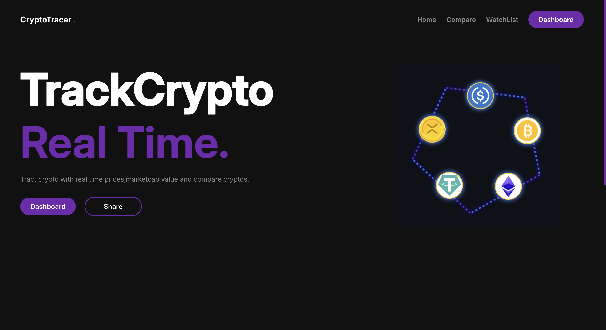
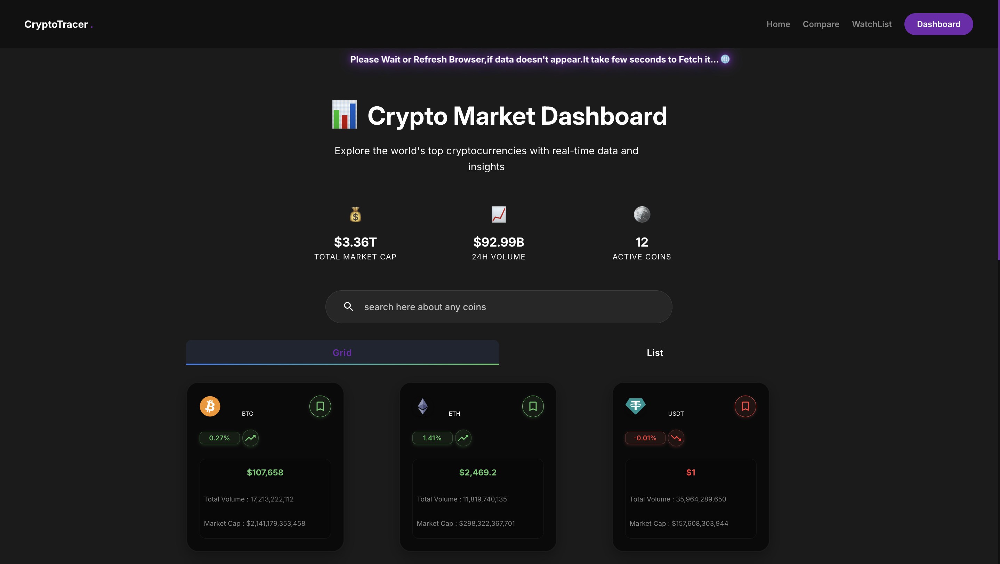
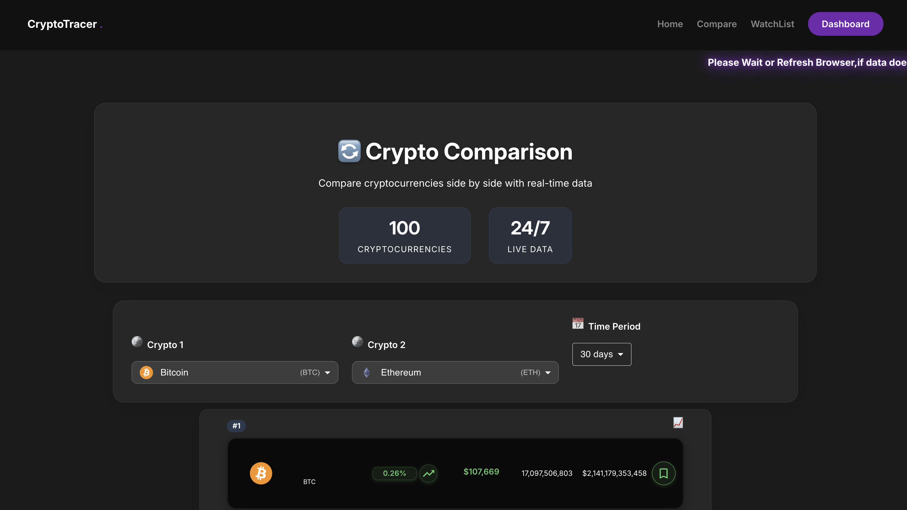
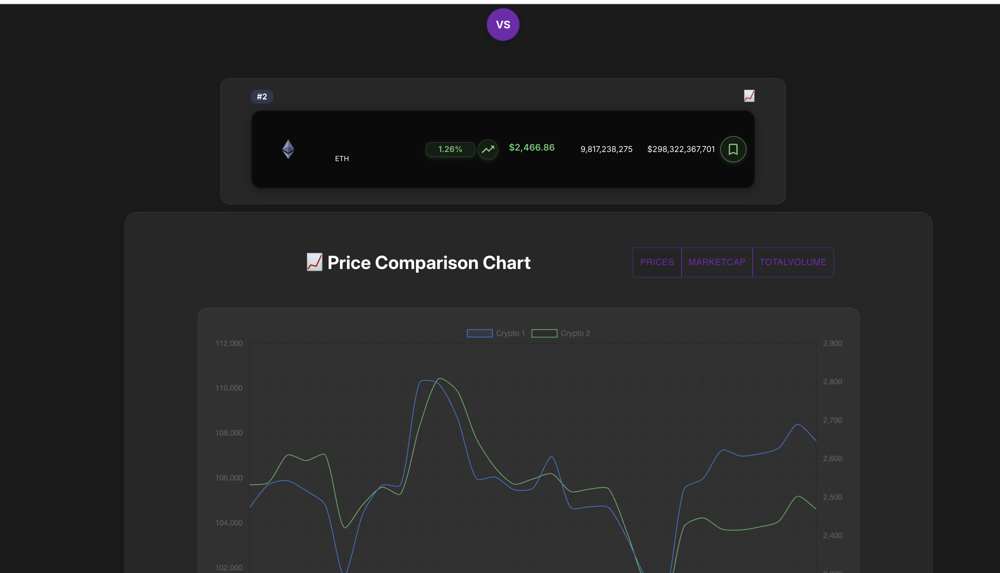
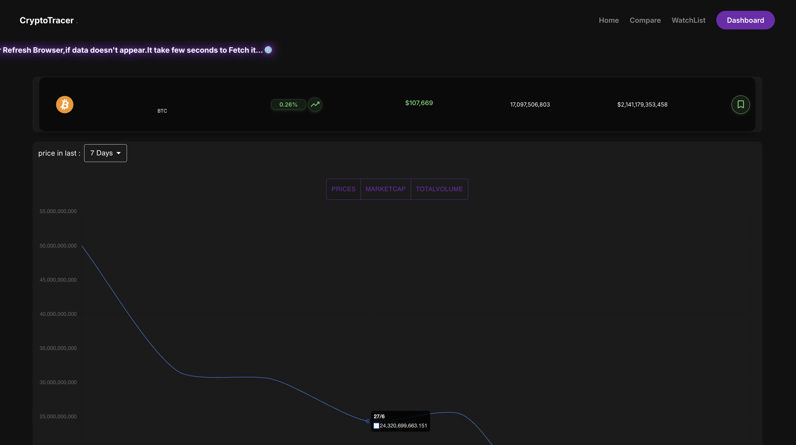

# Crypto Dashboard

A modern, responsive cryptocurrency dashboard and comparison app built with React. Track, compare, and analyze top cryptocurrencies with real-time data, beautiful charts, and robust error handling.

---

## 🚀 Features
- **Live Market Dashboard:** View top cryptocurrencies, market cap, and 24h volume.
- **Coin Details:** See price, volume, and market cap for each coin.
- **Compare Coins:** Side-by-side comparison with price charts and stats.
- **Watchlist:** Save your favorite coins for quick access.
- **Responsive Design:** Works beautifully on desktop, tablet, and mobile.
- **Caching & Error Handling:** Smart session caching and user-friendly error messages for API rate limits or network issues.

---

## 🖼️ Screenshots


| Home | Dashboard| Compare Page  |
|-----------|-------------|-------------|
|  |  |   | |


---

## 🛠️ Technologies Used
- React (functional components, hooks)
- CSS (custom, responsive, modern UI)
- Axios (API requests)
- Chart.js (price charts)
- react-toastify (notifications)

---

## ⚡ Caching & Error Handling
- **Session Storage Caching:** All API data is cached for 5 minutes. If the API is rate-limited or fails, cached data (up to 24h old) is shown with a warning.
- **User Notifications:** Users are notified via toast if they are seeing cached data due to an error.
- **Graceful Fallbacks:** Friendly error messages and retry options throughout the app.

---

## 🧑‍💻 Getting Started

1. **Clone the repository:**
   ```bash
   git clone https://github.com/Mohammadkaif196/CryptoTracer
   cd CryptoTracer
   ```
2. **Install dependencies:**
   ```bash
   npm install
   ```
3. **Start the development server:**
   ```bash
   npm start
   ```
4. **Open in your browser:**
   Visit [http://localhost:3000](http://localhost:3000)

---

## Resources
- [CoinGecko API](https://www.coingecko.com/en/api) for crypto data
- [Chart.js](https://www.chartjs.org/) for charts
- [react-toastify](https://fkhadra.github.io/react-toastify/) for notifications

---

## 👤 Author

**Shaik Mohammad Kaif**  
[GitHub](https://github.com/Mohammadkaif196)  
Email: kaif.presi@gmail.com

---

